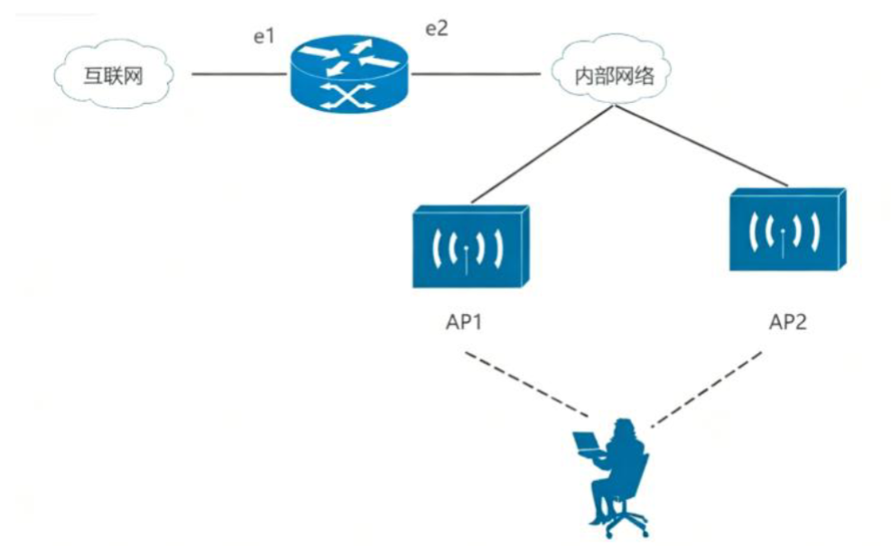

# 一、单选题（共 10 道题，每题 0.5 分，共 5 分）

1. 在日常使用手机时，我们可根据握持姿势实现屏幕自动旋转显示，这一功能的实现主要依赖手机内部的哪类传感器？（）

   A. 摄像头

   B. 触摸屏

   C. 陀螺仪

   D. 加速度计

   

2. OSI 参考模型将网络通信功能划分为 7 个层次，每个层次对应特定的协议数据单元，其中以 “分组”（数据包）作为协议数据单元的层次是（）

   A. 物理层

   B. 数据链路层

   C. 网络层

   D. 传输层

   

3. 某用户购买了标注容量为 250GB 的硬盘，将其安装到电脑后，系统磁盘管理中显示的实际可用容量最接近下列哪一项？（）

   A. 250GB

   B. 225GB

   C. 233GB

   D. 240GB

   

4. 在计算机信息系统安全管理中，为不同角色的登录用户分配差异化操作权限（如普通用户仅可查看、管理员可修改删除），实现这一需求的核心技术是（）

   A. 存取控制

   B. 身份鉴别

   C. 数据加密

   D. 物理隔离

   

5. 在计算机二进制编码中，补码既能简化运算又能解决符号位处理问题，其中 8 位补码能够表示的数值范围是（）

   A. -127~127

   B. -127~128

   C. -128~127

   D. -128~128

   

6. 结构化程序设计通过有限的基本结构组合实现复杂逻辑，是软件开发的重要方法，下列选项中属于其三种基本结构的是（）

   A. 顺序执行、选择执行、循环执行

   B. 顺序执行、分支执行、跳转执行

   C. 顺序执行、条件执行、重复执行

   D. 顺序执行、分支执行、循环执行

   

7. 软件能力成熟度模型（CMM）是评估软件组织开发能力和管理水平的核心标准，其分级体系中专门强调工程管理规范化和企业级质量理念的级别是（）

   A. 重复级

   B. 优化级

   C. 管理级

   D. 定义级

   

8. 计算机中西文采用 ASCII 码编码（1 个字节），中文采用 GBK 编码（2 个字节），某文本的十六进制内码为 CB F5 84 B4 C5 D3 33 41 C7 D6，该文本中包含的汉字和西文字符个数分别是（）

   A. 4 个汉字 2 个西文

   B. 3 个汉字 4 个西文

   C. 8 个汉字 2 个西文

   D. 4 个汉字 3 个西文

   

9. 某大型企业在全国多个城市设有分支机构，各机构需共享核心数据且需保障数据安全，同时要求灵活调配计算资源，适合该企业的云计算架构类型是（）

   A. 公有云

   B. 社区云

   C. 混合云

   D. 私有云

   

10. 将十进制数 984 进行进制转换后得到结果 1100110，该转换结果对应的进制是（）

    A. 2 进制

    B. 3 进制

    C. 4 进制

    D. 8 进制

# 二、多选题（共 5 道题，每题 1 分，共 5 分）

1. 人工智能生成内容（AIGC）技术快速发展，Deepseek 作为国内优秀的大语言模型，在实际场景应用中展现出诸多核心优势，下列属于其优势的有（）

   A. 中文语义理解精准

   B. 多轮对话逻辑连贯

   C. 专业领域知识覆盖广

   D. 生成内容时效性强

   

2. 计算思维是信息技术领域分析和解决问题的核心思维方式，是提升问题处理效率的重要工具，其主要特性包括（）

   A. 抽象性

   B. 构造性

   C. 系统性

   D. 可操作性

   

3. CPU 是计算机的核心运算部件，其性能直接决定计算机的运行速度和处理能力，下列属于衡量 CPU 性能的关键技术参数有（）

   A. 主频

   B. 核心数

   C. 缓存容量

   D. 制程工艺

   

4. 某 PC 机出现异常故障：无法通过浏览器输入域名访问任何 web 服务（如百度、网易），但能正常使用即时通信软件（如微信、QQ）收发消息，造成该故障的可能原因有（）

   A. 该机网卡故障

   B. 该机 IP 地址设置不当

   C. DNS 服务失效

   D. 浏览器感染计算机病毒

   

5. 数字图像技术可实现图像的采集、处理、存储和展示，在多个行业中得到广泛应用，下列属于数字图像应用场景的有（）

   A. 卫星遥感

   B. 计算机断层扫描

   C. 机械零件图绘制

   D. WPS office 中的艺术字编辑

# 三、简答题（每题 5 分，共 10 分）

1. 某单位计划搭建一套企业级 Web 服务，现需向云厂商采购云服务，初步确定采购范围包含 IaaS（基础设施即服务）、PaaS（平台即服务）、SaaS（软件即服务）三类。请结合 Web 服务的实际需求，分别简述三类服务需购买的核心虚拟设备、系统平台及应用软件。

   

2. 在软件设计与开发过程中，面向对象建模方法是构建清晰、可维护软件系统的核心技术，请简述软件设计中主流的面向对象建模方法。

# 四、实务题（共 3 题，共 40 分）

## 1. 共享单车管理系统设计题

某单位为解决职工上下班通勤问题，计划开发一套供内部人员使用的共享单车管理系统，核心功能是实现借车、还车流程：职工扫描共享单车上的二维码完成开锁，开锁成功后信息同步至管理系统，职工即可骑行；骑行结束后关锁还车，系统会自动采集本次骑行数据并存储到管理系统中。

根据以上材料，请回答下列问题：

(1) 设计该系统的关系模式（需明确各关系的主键）

(2) 编写 SQL 语句，查询 “2025 年 3 月期间，工号为 210045 的职工的总借车次数”

(3) 共享单车管理系统运行一段时间后，积累了大量职工骑行数据。为了提高车辆利用率和降低运营成本，可以采用数据挖掘方法从这些数据中分析出各种有用的知识，辅助运营管理部门进行决策，给出可能分析出的三种具体模式、规律或规则

------

## 2. 物资管理系统设计题

某单位因物资入库、出库操作频繁，计划开发一套物资管理系统用于物资盘点与管理。系统需存储物资的编号、名称、备注、现有量、最低库存量、存放位置等信息，可依据 “最低库存量” 触发物资补充，并在物资入库后自动更新 “现有量”，实现对物资的动态管理。

根据以上材料，请回答下列问题：

(1) 列出该物资管理系统的基础功能模块

(2) 描述物资入库的完整功能流程

(3) 假设用数组 RW 表示待入库的物资信息，用数组 KW 表示仓库当前存放的物资信息，给出 RW 和 KW 的数据结构以及实现 “入库” 功能的伪代码。

------

## 3. 计算机网络

某单位内部网络拓扑如图所示，用户使用笔记本电脑以移动方式连接无线基站的接入点（Access Point, AP）设备，然后 AP 设备通过有线网络连接内部局域网。路由器的 `e1` 端口作为网关连接外网，`e2` 端口连接内部网络；无线接入点 `AP1`、`AP2` 与内部网络有线连接，工作人员携带的笔记本电脑可通过这两个无线 AP，实现单位内部网络的无线漫游。

根据以上材料，请回答下列问题：

(1) 为了保证笔记本电脑在无线局域网覆盖范围内实现无缝地漫游，请从标识符、信道、覆盖范围、加密方式四个维度，写出对 `AP1` 与 `AP2` 的配置要求；

(2) 现有携带笔记本的用户需要临时接入互联网，在 IP 地址资源紧缺的情况下，请分别从 IP 地址获取和 IP 地址转换两个角度，描述可能用到的技术。

