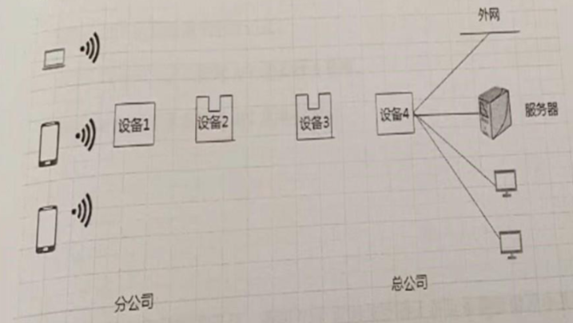

### 一、单选题（每题 0.5 分，共 10 分）

1. 我国自 2002 年开始实施《计算机软件保护条例》。根据条例规定，下列关于软件著作权说法错误的是（ ）

   A. 条例旨在保护计算机软件著作权人的权益，调整计算机软件在开发、传播和使用中发生的利益关系。

   B. 软件著作权人享有发表权、署名权、修改权、发行权、出租权、信息网络传播权、翻译权及应当由软件著作权人享有的其他权利。

   C. 自然人的软件著作权，保护期为自然人终生 50 年。

   D. 法人或者其他组织的软件著作权，保护期为 50 年。

2. 显示器工作时有电磁辐射，哪个方向辐射最小？（ ）

   A. 前面

   B. 后面

   C. 侧面

   D. 上面

3. （ ）是指软件的生产直到报废或停止使用的生命周期，其所经历各个阶段一般顺序。

   A. 软件设计、需求分析、软件实现、系统测试、运行和维护

   B.需求分析、软件设计、软件实现、系统测试、运行和维护

   C. 需求分析、软件设计、系统测试、软件实现、运行和维护

   D. 需求分析、软件实现、软件设计、系统测试、运行和维护

4. 计算机主板上通常安装了 CPU 插座、芯片组、存储器插槽、扩展卡插槽、显卡插槽，其中决定其性能好坏和级别高低的主要部件是（ ）

   A. IO 插口

   B. 显卡插口

   C. CMOS 存储器

   D. 芯片组

5. 邮件地址 `jsjapp@163.com` 中，`163.com` 代表的是（ ）

   A. 邮件内容

   B. 邮件协议

   C. 邮件服务器的域名

   D. 邮件名称

6. 基于 ARM 架构的智能手机处理器采用的指令集是（ ）

   A. HTTP

   B. CISC

   C. SMTP

   D. RISC

7. 面向对象程序设计语言不同于其他语言的主要特点是（ ）

   A. 模块性

   B. 抽象性

   C. 继承性

   D. 并行性

8. 视频是多幅静止图像，如电视、电影、计算机动画等，下列不属于视频文件格式的是（ ）

   A. MP3

   B. MP4

   C. AVI

   D. MPG

9. 数据处理是数据预处理过程中最重要的一个步骤，下列不属于数据清洗主要工作的是（ ）

   A. 消除数据源中的不一致性

   B. 填补缺损值

   C. 去除噪声数据

   D. 数据聚集

10. 计算机病毒主动传播是指攻击者对确定目标有目的地攻击。下列不属于计算机病毒主动传播方式的是（ ）

    A. 无线输入

    B. 有线输入

    C. 非法复制

    D. 接口输入

### 二、多选题（每题 1 分，共 5 分）

1. 解决 CPU 和主存储器之间速度差异的方法有（ ）

   A. 提高主存储器的容量

   B. 降低每次读取的数据量

   C. 采用 cache 存储器

   D. 改进 dram 的存储控制技术

2. 云计算中保障服务高可靠性的措施有（ ）

   A. 数据多副本容错

   B. 计算节点同构可互换

   C. 提高计算节点的数量

   D. 提供多种类型的服务

3. 丰富格式文本在简单文本基础上增加许多控制格式和结构说明信息，下列能保存丰富格式文本的类型有（ ）

   A. WPS

   B. TXT

   C. DOCX

   D. PDF

4. 数据仓库的存储结构中，其所涉及的索引结构有（ ）

   A. 层次索引

   B. 位图索引

   C. 广义索引

   D. 连接索引

5. 统一过程模型是一个通用软件开发过程框架，其过程是一系列组成系统生命周期阶段的迭代循环，每次循环包括（ ）

   A. 初始

   B. 细化

   C. 构造

   D. 移交

### 三、简答题（每题 5 分，共 10 分）

1. 在日常生活中，智能手机被广泛应用，请简述组成智能手机零部件中常用的传感器类型有哪些？

   

2. 请简述计算机网络的主要性能指标有哪些？

   

------

### 四、实务题（共 40 分）

1. 新冠疫情期间，接种点需要给市民注射疫苗，现需设计一套疫苗接种系统能够实现如下功能：

   - “登记” 功能：登记市民、医护人员的基本信息，疫苗药物入库情况的信息
   - “预约” 功能：预约疫苗进行注射；
   - “管理” 功能：管理市民注射疫苗情况；
   - “查询” 功能：市民可以通过系统查询获知预约和接种情况。

   (1) 画出系统的 E-R 图

   (2) 给出系统的关系模式。

2. 一个景区入口 A，出口 B，景区里面景点集合记为 S，景点与景点边集合记为边序列 E，其中 `ei(u,v,w)`，w 是距离，路径经过网格点 `ck`，`ck(xk,yk,zk)` 为三维坐标。

   (1) 试说明如何找到浏览完景点的最短路径的步骤。

   (2) 已经得出最短路径，经过的路径序列 `route={{c1,c2,c3},{c4,c5,c6,c7},{c8,c9}}`，网格点 `ck`，`ck(xk,yk,zk)` 为三维坐标，伪代码写出如何得到最短路径长度（`ei` 等于多少）。

3. 某集团由总公司和分公司构成，在网络结构部署方面：总公司采用的是有限局域网构建方式，并与 internet 互通，集团中的核心加密数据放在总公司的服务器中。为拓展分公司网络，使其可以与总公司的局域网互通，同时能访问总公司服务器，并要求分公司与总公司以中继的方式实现连通，先有分公司与总公司网络结构示意图。

   

   (1) 请补充完善网络图示意图中的四个设备，并说明设备 2 和设备 3 的连接方式。

   (2) 请给出总公司和分公司完整的网络拓扑结构图。

