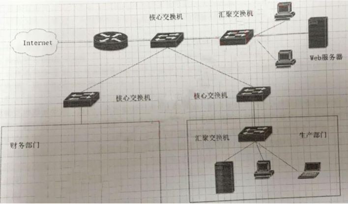

### 一、简答题

1. 计算机图像在日常工作生活中经常使用，请结合日常工作生活，简述常见的图片文件格式并描述其特点。

   

2. 某小区快递服务点每天都要处理近千个包裹。目前的做法是，快递员对包裹依次编号，然后随机放到货架上的空位中，并将编号发给用户，取快递时根据用户提供的编号，挨个查找。该过程可类比于计算机的什么查找方法。请以计算机查找策略的角度，给出提高快递员查找效率的方法。

   

------

### 二、实务题

1. 疫情期间，某公司为方便管理员工进出情况，拟开发一个员工进出管理 APP。该公司有几十名员工，在进出公司门前，首先要向管理员提交进出申请，多名管理员可以对员工进出申请进行批准。公司有多个门，在员工进出门时，通过扫码门上的二维码，可以获取管理员对员工进出申请进行批准情况，同时会对员工的进出情况进行记录。

   (1) 写出员工进出管理 APP 的实体关系图。

   (2) 写出员工进出管理 APP 的关系模式。

   

2. 某餐馆为方便职工订餐，拟开发一个订餐系统 APP，餐馆可为职工提供两种套餐，一种是两荤一素，一种是两素一荤。其中荤菜包括牛肉、猪肉、大虾、鸡肉，素菜包括菠菜、青菜、豆角、丝瓜、空心菜，主食包括米饭、馒头、面条。该订餐系统包括套餐选择、菜品选择、订单支付等功能。请你设计该订餐系统 APP 的人机交互界面。

   

3. 某企业的网络拓扑图如下：

   

   (1) 请简述路由器、核心交换机、汇聚交换机的功能特点。

   (2) 为防止企业财务数据遭到内部工作人员的恶意篡改或网络攻击，企业要求为财务部门增加高等级的防护措施，请按照企业要求，补充绘制财务部门的网络拓扑图。