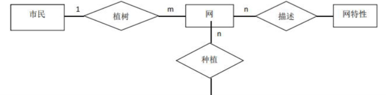

### 一、单选题

1. 目前很多停车场入口都安装了摄像机，通过拍照实现停车计费，其实用技术是（ ）

   A. RFID 技术

   B. 图像识别

   C. 数字取证

   D. 隐私保护

2. 小张在进行阅读工作汇报时希望每张幻灯片在停留几秒后自动翻页，则在 Powerpoint 中需要设置的选项是（ ）

   A. 幻灯片背景样式

   B. 幻灯片切换模式

   C. 幻灯片自动切换模式

   D. 幻灯片母版格式

3. 现代计算机和通信设备的核心部件是（ ）

   A. 晶体管

   B. 继电器

   C. 电子管

   D. 芯片

4. 从数据结构的角度来看，某用户微信好友之间的关系所表示的逻辑结构是（ ）

   A. 队列

   B. 栈

   C. 树

   D. 图

5. 下列访问速度最快的存储器是（ ）

   A. SD 卡

   B. 光盘

   C. U 盘

   D. 固态硬盘

6. 我国自主研制成功的北斗导航系统所采用的是通信技术是（ ）

   A. 微波通信

   B. 光纤通信

   C. 卫星通信

   D. 蓝牙通信

7. 以下不属于路由器功能的是（ ）

   A. 选择路由

   B. 转发 IP 数据报

   C. IP 地址转换

   D. 协议转换

8. 为了解决 IPV4 地址不足问题，IPV6 扩展 IP 地址长度后的位数是（ ）

   A. 32

   B. 128

   C. 64

   D. 256

9. 下列属于主动保护系统面授攻击的网络安全技术是

   A. 口令

   B. 指纹识别

   C. 数字签名

   D. 入侵检测

10. 一个分辨率为 1280*1024，颜色分量采用 8 位表示的数码相机所拍摄的彩色照片。无压缩是数据大小最接近的是（ ）

    A. 1.25MB

    B. 2.5MB

    C. 3.75MB

    D. 5.0MB

### 二、多选题

1. 超文本文档借助超链接将各种对象相互链接起来，下列各式的文档具有超链接功能的有（ ）

   A. .txt

   B. .jpg

   C. .html

   D. .ppt

2. 相比 4G 通信技术，利用 5G 通信技术可以更好支持的应用有（ ）

   A. 地震监测

   B. 可穿戴产品

   C. 3D 打印

   D. 人脸识别

3. 用户打开网页时出现 “404 NOT FOUND”，其产生的原因可能有（ ）

   A. 网络不通

   B. 网址不存在

   C. 网页内容太大

   D. 网页不存在

4. 关联规则挖掘的目的是发现自然界中某一事物发生时其他事物也会发生的关联关系，下列属于关联规则挖掘算法的有（ ）

   A. ID3

   B. Apriori

   C. FP-growth

   D. K-means

5. DBMS 是位于用户与操作系统之间的一层数据管理软件，其包含的主要功能有（ ）

   A. 数据定义

   B. 数据操纵

   C. 数据组织

   D. 数据存储

### 四、简答题（本大题共有 2 小题，每小题 5 分，共 10 分）

1. 请结合实际简述一个单位职工管理信息系统的开发过程。

   

2. 检索引擎是帮助人们在网页中查找信息的一种应用软件，按其工作方式可分为全文引擎和目录索引类搜索引擎两类，请分别给出这两类搜索引擎的典型案例。

   

------

### 五、实务题（40 分）

1. 某林场为了积极响应 “植树造林、造福后代” 的号召，邀请市民到林场进行植树活动。请你为林场开发一个管理信息系统，记录市民种植信息，市民可以查看自己所植树的长势情况。

   假设该系统的实体关系图如下：

   \

   (1) 请给该系统的关系数据模式；

   (2) 请给出查询某市民所植的树所在模块的 SQL 语句。

   

2. 下面是一段程序的代码：

   

   ```java
   public interface ICar{
       public void run();
   }
   public interface IDriver{
       public void drive(ICar car);
   }
   public class MyCar1 implements ICar{
       private String name;
       public void run(){
           System.out.println("MyCar"+name+" is running…");
       }
   }
   public class MyCar2 implements ICar{
       private String name;
       public void run(){
           System.out.println("MyCar"+name+" is running…");
       }
   }
   public class Driver implements IDriver{
       private String name;
      public void drive(ICar car){
          System.out.println("MyCar"+name+" is running…");
          car.run();
      }
   }
   ```

   (1) 请给出所包含的类及其属性与方法、接口及方法；

   (2) 请给出该段程序的类图。

   

3. 某企业建立的局域网如下图所示，要求该局域网接入外网时具备安全防护功能：

   (1) 请给出图中 A、B、C 三处合适的设备名称；

   (2) 请给出图中 D、E 两处合适的有限传输介质，并简要说明理由。

   

   

   


