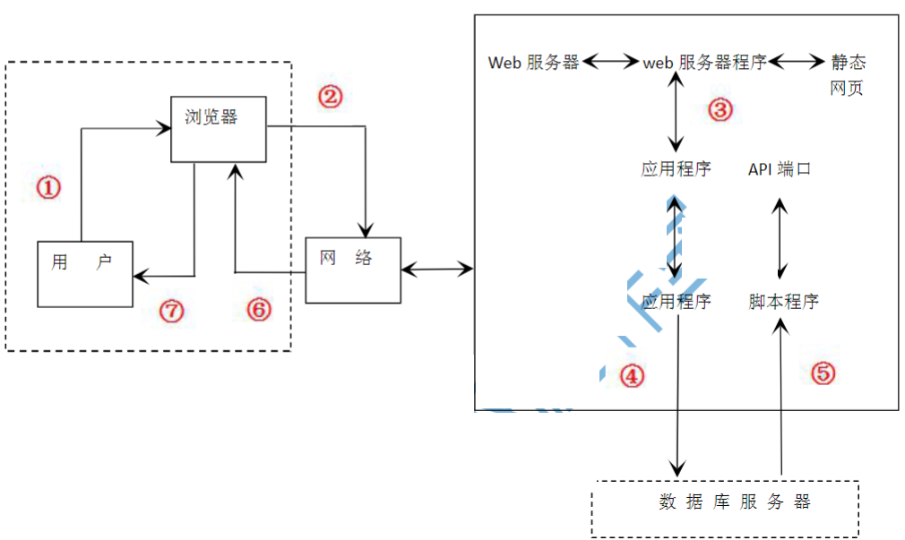

### 三、简答题

1. 请结合实际简述 3D 打印有哪些应用？
2. 从 “置用户于控制之下”，“减小用户记忆负担”，“保持界面一致” 三条黄金原则简述用户界面设计的要求。

------

### 四、实务题

1. 某公司在某城市投入了大量共享单车供用户使用，现拟开发一个共享单车 APP，该 APP 实现用户管理，借车和还车等功能。

   (1) 给出该 APP 的 “借车” 和 “还车” 功能的业务流程。

   (2) 根据该业务流程设计的实体和关系，给出 APP 的数据关系模式。

   

2. 下面是采用递推和迭代方法实现想用的功能的伪代码：

   ```
   function fac1(int n): int
   begin
       int p = 1
       from i = 1 to n
       begin
           p = p * i
       end
       return p
   end
   
   function fac2(int n): int
   begin
       if n = 1 then
           return 1
       else
           return n * fac2(n-1)
       end
   end
   ```

   

   (1) 分别给出函数`fac1`和`fac2`采用的实现办法，并说明理由。

   (2) 请给出幂函数（f(x)=x2），采用递推方法实现伪代码。

   

3. 某单位构建了如下图所示 B/S 结构 web 应用系统，假设某用户需要通过该应用系统进行信息查询，请依据序号补充完成过程。

   
